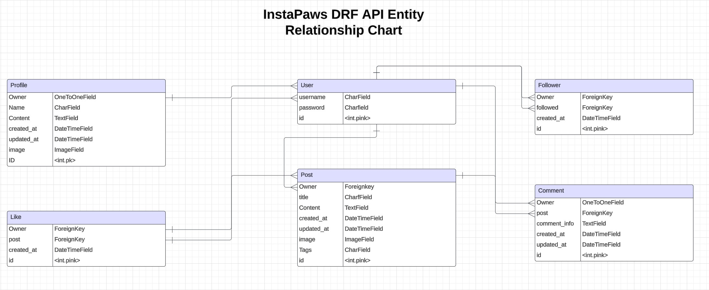

<h1 align="center">InstaPaws Django Rest Framework API - Project Portfolio 5</h1>

### [View the live project here](https://instapaws-f3da7aad813f.herokuapp.com/) #
### [View the deployed API here](https://instapaws-api-7ae61eec653f.herokuapp.com/) #
### [View the API repository here](https://github.com/Brad-Hammond/InstaPaws-API) #

## User Stories

From a backend perspective, the API's user stories center around CRUD operations and authentication functionalities.
1. As an admin, I want the ability to create profiles, posts, likes, and comments so that I can manage content effectively.
2. As an admin, I want the ability to update profiles, posts, likes, and comments so that I can modify any content as needed.
3. As an admin, I want the ability to delete profiles, posts, likes, and comments so that I can remove any content that is harmful or inappropriate.

## Database Model Structure

### Profile Model

- This model establishes a one-to-one relationship with the User model, which is imported from django-allauth.
- The Profile model includes all fields associated with a user’s profile upon creation. These fields are as follows:
1. owner: OneToOneField linked to the User model
2. created_at: DateTimeField representing when the profile was created
3. updated_at: DateTimeField representing when the profile was last updated
4. name: CharField for the profile's name
5. content: TextField for additional profile information
6. image: ImageField with a default profile image

### User Model

- This model is imported from django-allauth and is integrated into all functional model classes.
- The User model includes several fields associated with various foreign models within the application:
1. Profile model: The owner field establishes a OneToOne relationship with the User model.
2. Posts model: The owner field holds a ForeignKey relationship with the User model.
3. Likes model: The owner field holds a ForeignKey relationship with the User model.
4. Followers model: The owner and followed fields hold ForeignKey relationships with the User model, representing "following" and "followed" connections.
5. Comments model: The owner field holds a ForeignKey relationship with the User model.

### Post Model

- The Post model includes all fields associated with a post created by a logged-in user. These fields are as follows:
1. owner = ForeignKey with User field
2. created_at = DateTimeField
3. updated_at = DateTimeField
4. title = CharField
5. tags = CharField with choices from tags_array
6. content = TextField
7. image = ImageField with default post image

### Follower Model

- The Follower model includes all fields associated with a logged-in user attempting to follow another profile. These fields are as follows:
1. owner = ForeignKey with User field
2. followed = ForeignKey between User field and followed field
3. created_at = DateTimeField

### Like Model

- The Like model includes all fields associated with a logged-in user attempting to like a created post. These fields are as follows:
1. owner = ForeignKey with User field
2. post = ForeignKey between Post model field and likes field
3. created_at = DateTimeField

### Comment Model

- The Comment model includes multiple fields associated with the content and metadata of comments. These fields are as follows:
1. owner = owner field holds ForeignKey relationship with User model
2. post = post field holds ForeignKey relationship with Post model
3. comment_info = TextField for comment input
4. created_at = DateTimeField
5. updated_at = DateTimeField

## Languages and Technologies Used

- This project was developed primarily using Python, a versatile programming language commonly used for building websites, software applications, task automation, and data analysis.

- The API was built using Django, a robust framework designed to streamline the development of secure and maintainable websites. It offers a wide range of tools and features that enable efficient and rapid application development.

### Tools Used

- [Django Rest Framework](https://www.django-rest-framework.org/) was utilized to implement and enhance various features of the API.
- [Cloudinary](https://cloudinary.com/) was used to manage and store static files, including assets for general styling and user-related features.
- [Visual Studio Code](https://code.visualstudio.com/) my preferred integrated development environment, was used for coding and project management.
- [GitHub](https://github.com/) served as the platform to host and manage the project's code repositories.
- [Heroku](https://dashboard.heroku.com/apps) was utilized for hosting and deploying the API to a live environment.
- [PostgreSQL](https://www.postgresql.org/) functioned as the relational database for managing and storing user-related data.
- [Pillow](https://python-pillow.org/) provided image input validation, including filtering by resolution and dimensions.
- [Psycopg2](https://pypi.org/project/psycopg2/) database adapter for Python.

## Testing

To verify the functionality of my API, I conducted manual tests for both user and admin roles.

### Validation

- [PEP8 Linter](https://pep8ci.herokuapp.com/) I utilized a PEP8 linter to ensure that my code adhered to PEP8 standards. Each .py file in the project was tested and successfully validated, confirming compliance.

### Manual Testing of User Stories

1. As an admin, I want create functionality of all profiles, posts, likes, and comments.
2. As an admin, I want update functionality of all profiles, posts, likes, and comments so that I can edit any content I choose to.
3. As an admin, I want delete functionality of all profiles, posts, likes, and comments so that I can delete any content that may be deemed as harmful.

| # | Test | Functionality | Expected Outcome | Actual Outcome |
| --- | --- | --- | --- | --- |
| 1 | User | CRUD functionality for users | A user can be created, viewed, updated, or deleted. | Functionality works as expected. |
| 2 | Profile | CRUD functionality for profiles | A profile can be created, viewed, updated, or deleted for a user (only own profile). | Functionality works as expected. |
| 3 | Posts | CRUD functionality for posts | A post can be created, viewed, updated, or deleted for a user (only own posts). | Functionality works as expected. |
| 4 | Likes | Create and delete likes | A like can be added to or removed from a post by a logged-in user (not on own posts). | Functionality works as expected. |
| 5 | Followers | Create and delete followers | A follow can be added to or removed from another user by a logged-in user. | Functionality works as expected. |
| 6 | Comments | CRUD functionality for comments | A comment can be created, viewed, updated, or deleted, associated with a post (only own comments). | Functionality works as expected. |

<strong>The table above covers all of my user stories, including the creation, updating, and deletion functionalities for all aspects of my website. </strong>

- I conducted thorough manual testing across all the models and components I developed to ensure their functionality and reliability. The components tested include Likes, Posts, Profiles, Comments, and Followers. Each component was carefully tested to verify its behavior in various scenarios, including:
1. Likes: Ensuring users can like posts, while preventing users from liking their own posts.
2. Posts: Verifying that users can create, read, update, and delete their own posts, while ensuring they cannot modify posts created by others.
3. Profiles: Testing profile creation, updating, and deletion functionalities, ensuring users can only edit their own profiles.
4. Comments: Confirming that users can add, edit, delete, and view comments associated with posts, with restrictions on editing or deleting comments by others.
5. Followers: Testing the ability to follow and unfollow other users while ensuring users cannot follow themselves.

- Each of these components was tested in isolation and integrated into the system to ensure smooth interactions and proper functionality. Through this process, I validated that the API behaves as expected in all tested scenarios.

## Known Bugs

- The Django admin panel on the launched drf-api has no css, and I am unsure of how to change this.

## Credits

- Inspiration from this API was taken from the [Moments](https://github.com/Code-Institute-Solutions/drf-api) walkthrough project from Code Institute and helped within the guidance and steps of creating this API.

- Please note I was not assigned a mentor for my Portfolio Porject 5 so this project was completed without any mentorship.